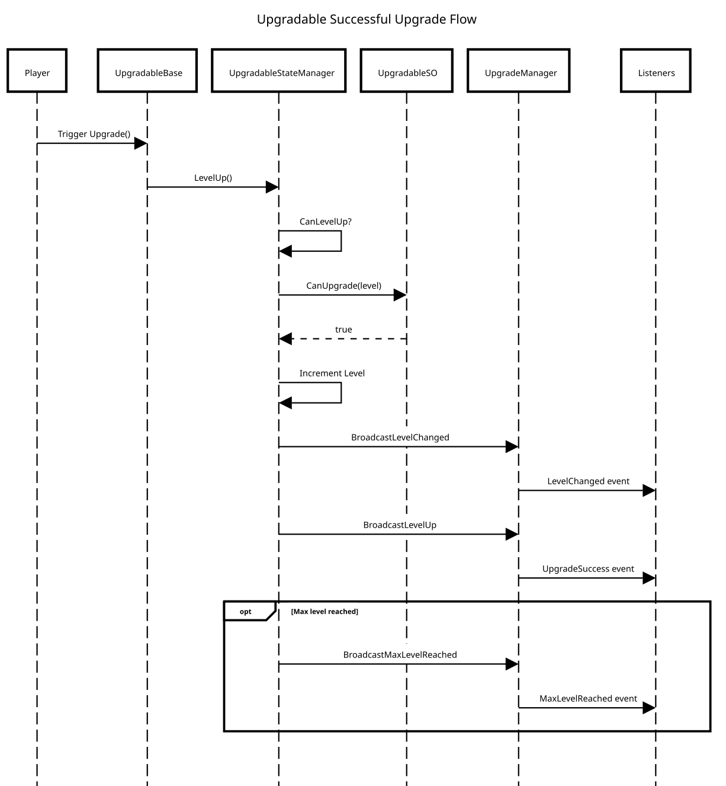
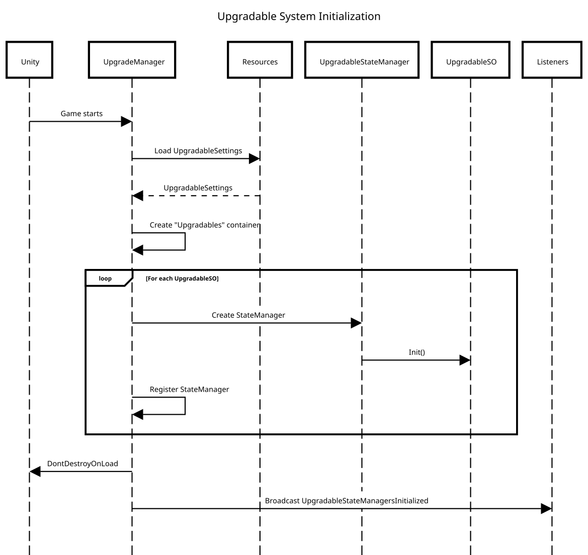

# 🛠 Upgradable System

## 🎯 Goals
> **Players**
>
> Allow players to upgrade gameplay elements (buildings, portals, objects, etc.) through a level-based progression system.

> **Developers**
>
> Provide a modular, extensible, and data-driven upgrade system that supports:
> - Multiple upgrade levels
> - Conditional upgrades
> - Multiple instances of the same upgradable type
> - Centralized state management
> - Event-driven architecture

## 🧩 Summary
- **Type**
    - Gameplay / Progression
- **Dependencies**
    - VV.Utility

## 🧱 Architecture

### Concept Overview
The Upgradable System is built around **three main pillars**:
1. **Data** — Defines what can be upgraded and how
2. **State** — Stores and synchronizes upgrade levels
3. **Runtime Behaviours** — React to upgrade state changes

### Core Components
- **UpgradableSO**
    - Defines an upgradable type
    - Contains level data, conditions, scores, and instances
- **UpgradableStateManager**
    - Holds the runtime state (current level)
    - Handles level up / down logic
    - Broadcasts upgrade events
- **UpgradeManager**
    - Global static manager
    - Initializes all upgradables at runtime
    - Dispatches upgrade-related events
- **UpgradableBase**
    - Base class for any upgradable GameObject
    - Connects scene objects to their corresponding state manager

### UML

#### Forindustrie Class Diagram

#### VV Class Diagram

#### Successful Upgrade Flow

#### System Init

### Script Structure

    Scripts
    ├── Upgradables
        ├── Conditions
            ├── IUpgradeCondition.cs
            ├── IUpgradeConditionDataProvider.cs
            ├── UpgradeConditionDataAccessor.cs
            ├── UpgradeConditionSO.cs
            ├── UpgradeTrigger.cs
        ├── Data
            ├── UpgradableInstanceConfigSO.cs
            ├── UpgradableOverrideSO.cs
            ├── UpgradableSO.cs
        ├── Network
            ├── UpgradablePayloadHandler.cs
            ├── UpgradableServiceHandler.cs
            ├── UpgradableSocketController.cs
            ├── UpgradableSocketHandler.cs
        ├── Portal
            ├── CompletionPercentageConditionSO.cs
            ├── UpgradablePortal.cs
            ├── UpgradablePortalStateManager.cs
        ├── RepairableBuilding
            ├── UI
                ├── BuildingTooltipUIData.cs
                ├── DecalMaterialController.cs
                ├── StolenBuildingTooltip.cs
            ├── CollectionAmountUpgradeConditionSO.cs
            ├── UpgradableBuilding.cs
            ├── UpgradableBuildingStateManager.cs
        ├── Settings
            ├── UpgradableSettings.cs
            ├── UpgradableSettingsProvider.cs
        ├── FIUpgradableScoreTrigger.cs
        ├── ForindustrieUpgradable.cs
        ├── ForindustrieUpgradableStateManager.cs
        ├── UpgradableBase.cs
        ├── UpgradableEventHandler.cs
        ├── UpgradableStateManager.cs
        └── UpgradeManager.cs

## ⚙️ Internal

### Initialization Workflow
1. Game starts
2. `UpgradeManager.OnRuntimeInitialized()` is called
3. `UpgradableSettings` is loaded from `Resources`
4. A global **Upgradables** container is created
5. One `UpgradableStateManager` is generated per:
    - Upgradable type **or**
    - Upgradable instance
6. State managers are stored in a global dictionary
7. Events are initialized
8. System is ready

### Upgrade Workflow
1. An object inheriting from `UpgradableBase` calls `Upgrade()`
2. The linked `UpgradableStateManager` checks:
    - Max level
    - Upgrade conditions for the current level
3. If valid:
    - Level is incremented
    - Events are broadcast
4. If invalid:
    - Upgrade failure event is broadcast

### Events System
The system is fully event-driven:
- `UpgradeSuccess`
- `UpgradeFailed`
- `LevelChanged`
- `MaxLevelReached`
- `MaxLevelAlreadyReached`
- `RollbackToPreviousLevel`
- `UpgradableInitialized`

Events can be listened to globally or per upgradable ID.

## 🔧 Unity Configuration

### 1. Create an UpgradableSO
- Define:
    - Upgrade name
    - Unique ID
    - Max level
    - Level conditions
    - Score per level

### 2. (Optional) Create Instance Configurations
- Used when multiple instances of the same upgradable exist
- Each instance gets:
    - A unique ID
    - A scene reference
    - A readable instance name

### 3. Configure Upgradable Settings
- Add all active `UpgradableSO` assets
- Stored in `Resources/UpgradableSettings`

### 4. Add UpgradableBase to GameObjects
- Assign:
    - `UpgradableSO`
    - Optional `UpgradableInstanceConfigSO`
- The object automatically links to its `UpgradableStateManager` at runtime

### 5. Trigger Upgrades
- Call `Upgrade()` from UI, gameplay logic, or network events

## 🔗 Dependencies
- VV.Utility

## 🧪 Tests
> - [ ] Implement tests
> - **Unit Tests**
>    - [ ] Upgrade condition validation
>   - [ ] Level boundaries
> - **Integration Tests**
>   - [ ] StateManager initialization
>   - [ ] Instance resolution
> - **Gameplay Tests**
>   - [ ] Multi-instance upgrades
>   - [ ] Rollback scenarios

## 🚀 Limits & Optimisations
- Uses a centralized dictionary for fast lookup
- Designed to be multiplayer-friendly via forced state updates
- Current limits:
    - No built-in persistence (save/load)
    - Event dictionaries could be further optimized per instance/type

## 📌 Notes
- Events are global and can become noisy if not scoped properly
- Instance IDs take priority over type IDs
- System is designed to be extended rather than modified
